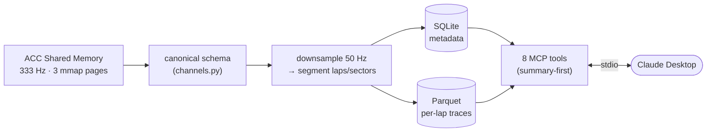

# pitwall

> An MCP server that turns Claude into your sim-racing race engineer.

`pitwall` ingests your Assetto Corsa Competizione telemetry, stores it locally,
and exposes it to Claude Desktop as a small set of tools. Ask Claude things like
*"What was my brake pressure into Turn 1 on my fastest lap?"* and it queries your
real laps to answer.

**Status:** v0.1 shipped — **ACC** (live + `.pwcap` replay) and **iRacing `.ibt`**
replay, exposed to Claude through 8 MCP tools. Phase 2 (an **AI coach** that reads a
lap and returns structured + human-readable feedback) is in progress: the
`pitwall-coach` CLI and its agentic tool-use loop are built and tested offline — see
[Roadmap](#roadmap). Live iRacing (`irsdk`) lands in v0.2.

## Why this project

A telemetry-to-LLM pipeline built end-to-end, with the engineering decisions a
recruiter or eng manager can inspect as receipts:

- **A canonical channel schema** ([`channels.py`](src/pitwall/channels.py)) that maps
  two very different games (ACC Shared Memory, iRacing `.ibt`) onto one game-agnostic
  vocabulary — so storage, queries, and the AI layer never learn game specifics.
- **A deliberate storage split** — SQLite for metadata, columnar Parquet for per-lap
  traces — chosen for the real access pattern (distance-range channel slices), not by
  default.
- **Token-budget discipline** — tool responses default to summary stats with a
  `detail_level` knob, a **41×** context saving over raw traces (measured).
- **A provider-agnostic agentic loop** — the Phase 2 coach drives an LLM through the
  query tools and terminates on a structured report; the LLM backend is a swappable
  seam (Gemini today, Claude drop-in later).
- **Evidence, not claims** — 190 automated tests (no game required), published
  [benchmarks](BENCHMARKS.md), and a real-session [demo](#pitwall).


> 🏁 Claude Desktop answering the five questions below over the `pitwall` MCP server, against a real Nürburgring / Ford Mustang GT3 session.

## What it feels like

Driven, ingested, and asked against a real Nürburgring / Ford Mustang GT3 session
(numbers straight from the tools — see [BENCHMARKS.md §6](BENCHMARKS.md)):

> **You:** What was my fastest lap at the Nürburgring?
> **Claude:** Your fastest *valid* lap was **2:04.126** (lap 2), topping out at
> 245 km/h. Two other laps were invalidated for going off-track.

> **You:** What was my brake pressure into the first braking zone on that lap?
> **Claude:** Through 206–515 m you averaged 23% brake with a stab to full, bleeding
> speed from 245 down to 175 km/h before the corner.

> **You:** How were my tyre temps holding up over the stint?
> **Claude:** Front-left ran hottest (86.7 → 88.1 → 87.8 °C across the three laps),
> with pressures steady at 26–27 psi — nothing overheating.

## Install

```bash
pip install pitwall-mcp
```

Add it to your Claude Desktop config (`claude_desktop_config.json`):

```json
{
  "mcpServers": {
    "pitwall": { "command": "pitwall" }
  }
}
```

Restart Claude Desktop. Then, to get your driving into the store Claude reads, run the
ingest command while you drive:

```bash
pitwall-ingest --watch      # start once; auto-ingests every session as you drive
# or, one session at a time / from a saved recording:
pitwall-ingest              # live, ends when the ACC session does
pitwall-ingest session.pwcap   # ingest a previously captured ACC .pwcap
pitwall-ingest session.ibt     # ingest an iRacing .ibt export (needs the iracing extra)
```

For iRacing `.ibt` files, install the optional extra first (it pulls in `pyirsdk` +
`pyyaml`): `pip install "pitwall-mcp[iracing]"`.

Launch ACC, drive some laps, and ask Claude about them.

> **Note:** ACC's Shared Memory only exists while ACC is running on the *same
> machine*. Install pitwall first; if you ask before driving, it tells you so
> instead of crashing.

## What Claude can ask

| Tool | What it answers |
|---|---|
| `list_sessions` | Find sessions by date, track, or car. |
| `list_laps` | List laps in a session, filter to valid / fastest. |
| `get_lap_summary` | Lap time, sector times, top/avg speed, fuel used, consistency vs PB, validity. |
| `get_telemetry_trace` | Channel data (throttle, brake, …) binned by track distance. |
| `compare_laps` | Where one lap gained or lost time vs another. |
| `get_sector_analysis` | Per-sector breakdown vs a reference lap. |
| `get_tire_history` | Tyre temps/pressures across a stint. |
| `export_lap_csv` | Export a lap's telemetry to CSV. |

The tool **descriptions** (not just their names) are written as instructions for
Claude — when to reach for each and what it returns. That's most of how well a
model uses an MCP server.

## How it works



Telemetry from each game is mapped into one **canonical channel schema**
(`src/pitwall/channels.py`) so storage, queries, and the MCP layer stay
game-agnostic. Metadata (sessions, laps, sectors) lives in **SQLite**; per-lap
traces are **columnar Parquet** (one file per lap) so distance-range channel slices
are cheap. Tool responses default to summary stats with a `detail_level` knob,
because a raw 50 Hz trace would blow Claude's context window (~30k tokens vs ~750
for the summary).

Full diagram and rationale: [`docs/architecture.md`](docs/architecture.md). Per-game
channel mapping: [`docs/channel-mapping.md`](docs/channel-mapping.md). Design notes:
[`notes/`](notes/).

## Performance

Measured end-to-end against a real 286 MB / 360 s ACC capture — full numbers and
reproduction steps in [BENCHMARKS.md](BENCHMARKS.md):

- **Ingest:** a whole session in **3.1 s** (117× realtime), ~53 MB peak working set.
- **Cold start → first tool call:** **1.06 s** (plan target: < 3 s).
- **Query latency:** metadata tools in **microseconds**, trace tools in **4–8 ms**.
- **Token budget:** summary trace **~750 tokens** vs ~30k for a full 50 Hz dump — a
  41× saving from the default.

## Development

```bash
python -m venv .venv && .venv\Scripts\activate   # Windows
pip install -e ".[dev]"
ruff check .
pytest                                            # 190 tests, no game required
python bench/run.py                               # reproduce the benchmarks
```

The ACC reader is regression-tested in CI without the game, by replaying a scrubbed,
slimmed capture (`tests/fixtures/acc-nurburgring-slim.pwcap`) through the real
pipeline.

## Roadmap

The MCP server (Phase 1) is the foundation for an AI race engineer. The trajectory:

| Phase | What | State |
|---|---|---|
| **1 — MCP telemetry server** | Ingest ACC/iRacing, expose 8 tools to Claude Desktop | ✅ Shipped (`v0.1.0`) |
| **2 — Single-agent coach** | Agentic tool-use loop reads a lap → structured `CoachingReport` + human feedback (`pitwall-coach analyze`) | 🚧 In progress — CLI + loop built, tested offline; live tuning next |
| **3 — Multi-agent** | Specialist agents (Braking / Throttle / Line / Tyre) + a Synthesis coach | Planned |
| **4 — Vision** | Fuse onboard video with telemetry | Optional |
| **5 — Evals** | Lap-time-delta + LLM-as-judge + consistency scoring | Planned |

The Phase 2 `CoachingReport` is persisted to SQLite as the hand-off contract into the
multi-agent architecture. The LLM sits behind a provider-agnostic `LLMClient` seam, so
the coaching engine is not tied to any one model.

## License & acknowledgements

MIT — see [LICENSE](LICENSE). The ACC Shared Memory page layout is publicly
documented by Kunos Simulazioni; pitwall reimplements that documented struct layout
in Python (it ships no Kunos code). iRacing `.ibt` ingest uses the MIT `pyirsdk`
project (the optional `iracing` extra); live iRacing (`irsdk`) lands in v0.2.
