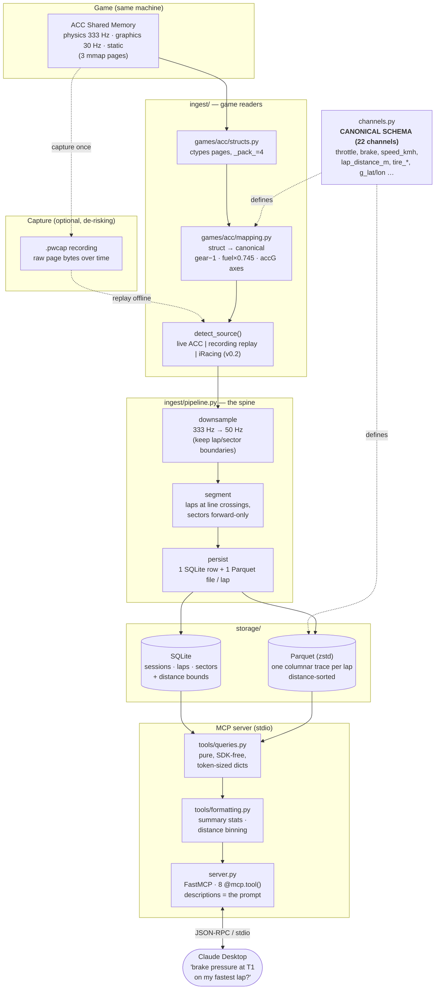

# pitwall — Architecture

One page: how a frame of telemetry becomes an answer Claude can give. The whole
design turns on one idea — a **canonical channel schema** that every game maps into,
so storage, queries, and the MCP layer never know or care which game produced the data.

## Why it's shaped this way

- **Canonical schema is the contract** (`channels.py`, written first). ACC's `gas`
  and iRacing's `Throttle` both become `throttle` *before* anything downstream sees
  them, so the pipeline, storage, and tools are written once and stay game-agnostic.
  Adding iRacing in v0.2 is a new reader at the top — nothing below changes.

- **Capture-then-replay de-risks the binary parsing.** The riskiest code is the
  ctypes struct layout. A tiny capture tool dumps raw shared-memory bytes to a
  `.pwcap` once; the struct + mapping are then developed and regression-tested
  *offline* against it, and a scrubbed, slimmed slice is committed as a CI fixture —
  so the ACC reader stays tested forever without the game running.

- **Downsample to 50 Hz on ingest.** Human reaction is ~250 ms; 50 Hz (20 ms) is well
  below any change a coach can act on. Storing 333 Hz is 6.6× the data for zero
  coaching value — but boundary frames (lap/sector changes) are always kept so
  segmentation stays exact.

- **SQLite for metadata, Parquet for traces** — deliberately split. The core access
  pattern is "the brake channel between 200 m and 400 m on lap 7": column-slicing by
  distance, which row-based SQLite blobs handle terribly and columnar Parquet handles
  for a few ms (see [BENCHMARKS.md](../BENCHMARKS.md) §3).

- **Narrow tools, summary-first responses.** Eight small tools, each described like a
  docstring *for Claude* (the descriptions are the prompt engineering). Responses
  default to per-sector summary stats; a `detail_level` knob trades tokens for
  resolution, and traces bin by **distance, not time**, because a coach reasons about
  places on the track. A full 50 Hz trace is ~30k tokens; the summary is ~750
  (BENCHMARKS.md §4).
